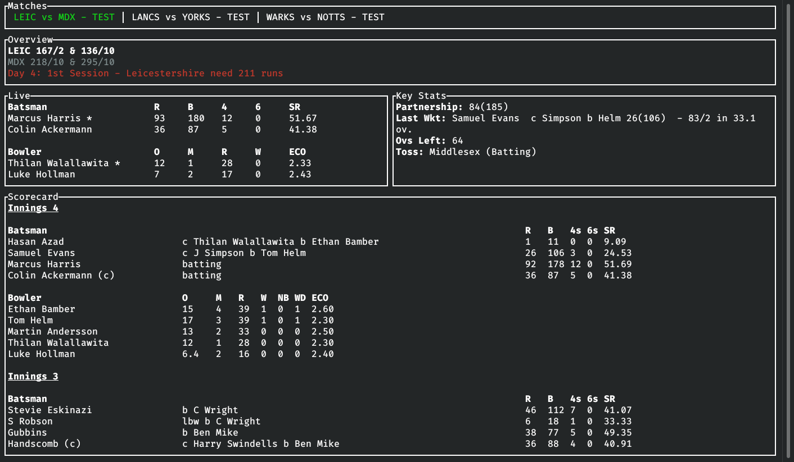

# cricket-rs


A terminal based fast and optimized live cricket score viewer.



## Supported Operating Systems

* Should support any Linux distro(if not, please open an issue).
* Windows.
* MacOS(Not tested).

## Installation

* Download the binary for your OS from [releases](https://github.com/pmk21/cricket-rs/releases).
* Install directly from the repository -
   1. **Prerequisites:** `rust` and `cargo`
   2. `git clone` this repository.
   3. `cargo install --path .` should install the binary. Make sure `$HOME/.cargo/bin` is in your `$PATH` variable.

## Usage

```output
USAGE:
    cricket-rs [OPTIONS]

FLAGS:
    -h, --help       Prints help information
    -V, --version    Prints version information

OPTIONS:
    -m, --match-id <ID>               ID of the match to follow live [default: 0]
    -t, --tick-rate <MILLISECONDS>    Sets match details refresh rate [default: 10000]
```

* How to get the match ID -
  * Go to the cricbuzz page showing the match live.
  * From the URL of the page extract the match ID.
  * Example URL - `https://www.cricbuzz.com/live-cricket-scores/<match-id>/series-name...`.
  * Then run the CLI using the match ID - `cricket-rs -m <match-id>`.

## Keyboard Bindings

| Key                         | Description           |
| --------------------------- | --------------------- |
| <kbd>↑</kbd>                | Scroll scorecard up   |
| <kbd>↓</kbd>                | Scroll scorecard down |
| <kbd>←</kbd> & <kbd>→</kbd> | Switch tabs/matches   |

## Contributing

Take a look at the [guide](CONTRIBUTING.md).

## License

MIT License
